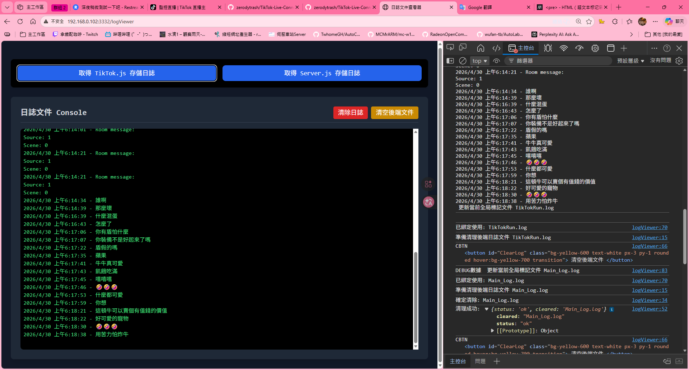

# Web服務端 的其他新功能


### **可視化網頁 進行日誌文件查看**

目前預設兩個按鈕 是以預設配置日誌文件名為主

如果你當前有需要更換預設日誌文件名的需求

請手動 更正 `writeLog()` 指向的Default文件名\
以及 `logFile.html` 指向的日誌文件

一般而言 不需要改動他

```bash
GET http://localhost:3332/logViewer
```

此頁面提供切換指定日誌 與清除指定日誌文件




# 清除指定後端日誌文件

### **API Endpoint - Clear_LOG**
```bash
POST http://localhost:3332/Clear_LOG
```

### **Request Body**
```json
{
  "file": "Main_Log.log"
}
```

#### `file` **你要清除的對應日誌文件**

### **Response (成功範例)**
```json
{
  "status": "ok",
  "cleared": "Main_Log.log"
}

```


# 取得指定後端日誌文件

### **API Endpoint - Get_LOG**
```bash
GET http://localhost:3332/Get_LOG?file=你要查的日誌文件
```

#### `file` **你要取得的對應日誌文件**


### **Response (成功範例) 返回文本**
```log
2026-04-29T22:01:46.678Z - 掰掰下次在看
2026-04-29T22:01:46.682Z - 收到
```


