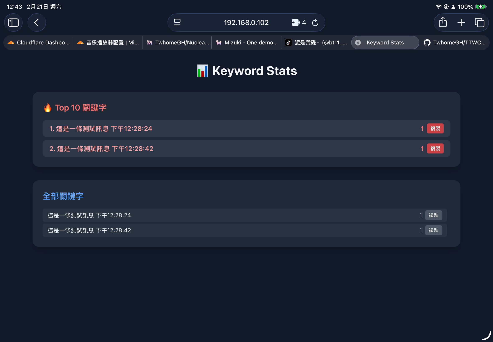

# TTWChatMessageServer

## 簡介

`TTWChatMessageServer` 是一個聊天室訊息服務器，可對接 **TikTok**、**Twitch**、**Kick**、**Odysee** 與 **Youtube** 的直播聊天室訊息，支援以下功能：

- 即時接收聊天室訊息
- 支援禮物、關注、加入、分享等事件
- 可推送到 **Bark** 或 **Socket**
- 可透過簡單 HTTP 接口開關服務
- 可透過簡單 HTTP 接口快速修改BARK/SocketAPI配置

---

## 最近更新

### 新增贊助廣告 (G#Ad) 管理系統

- 新增 `interval=` 參數，訂閱者可設定廣告自動重複間隔（最低 15 分鐘）
- 新增三種審核模式：不需審核（預設）、過濾器自動審核、手動審核
- 新增管理頁面 `/sponsor`，可瀏覽/通過/拒絕/啟用/停用/刪除贊助廣告
- 廣告資料持久化儲存於 `sponsor_ads.json`
- 新增 `/api/sponsor-ads/*` API 端點

### 管理頁面導航改進

- 主控台、關鍵字、日誌檔案頁面頂部新增快速導航按鈕
- `keyword.html` 改用相對路徑 `EventSource`，不再需要手動修改內網 IP
- `keyword.html` 頁面隱藏時自動關閉 SSE 連線，避免返回上一頁後連線殘留
- Server.js 關鍵字 SSE 端點移除無意義的 `pushLog` 刷版

### 新增 Youtube 直播聊天室支援

- 支援 Youtube 頻道直播聊天室訊息接收
- 透過 YouTube Data API v3 輪詢方式取得即時訊息
- 頻道名稱自動解析（支援頻道名稱或 @handle）
- Youtube 的聊天訊息**有頭像**（API 有提供 `profileImageUrl`）
- 自動遵循 API 的 `pollingIntervalMillis` 決定輪詢頻率
- 需要使用 Google API Key（請在 `.env` 設定 `YOUTUBE_API_KEY`）

#### 支援的事件

| 事件 | 類型 | 說明 |
|------|------|------|
| 💬 一般聊天 | `textMessageEvent` | 即時聊天訊息，可翻譯與過濾 |
| 💰 超級感謝 | `superChatEvent` | Super Chat 付費醒目訊息（含金額） |
| 🖼️ 超級貼圖 | `superStickerEvent` | Super Sticker 付費貼圖（含金額） |
| 🎉 新會員 | `newSponsorEvent` | 新的頻道會員加入 |
| 🎁 贈禮會員 | `giftMembershipReceivedEvent` | 收到贈送的會員資格 |
| ⭐ 會員里程碑 | `memberMilestoneChatEvent` | 會員達到里程碑 |

> **注意**：免費追隨（訂閱按鈕）不會觸發聊天室事件，僅有付費會員相關事件會出現。

### 新增 Odysee 直播聊天室支援

- 支援 Odysee 頻道直播聊天室訊息接收
- 透過 WebSocket 連接 sockety.odysee.tv 取得即時訊息
- 頻道名稱自動解析，不需手動輸入 claim ID
- 目前 Odysee 聊天訊息**不支援頭像顯示**（因 Odysee 的 WebSocket 資料未提供頭像網址）

### 其他更新

新增 Socket 最多重試上限
在`env`文件裡設置 最大重試次數 `SOCKET_RETRY_MAX_COUNT` 預設 最多3次

新增了聊天室訊息翻譯功能
如果語言不是中文會自動使用`env`裡的配置的翻譯API 進行翻譯
暫時還提供設置 控制哪一種語言以外才翻譯
不過你也可以透過更正**TranslateTest.js** 
function isChinese() 的判斷條件 來更正那個你的母語

未來版本 會去補充更正此環節 讓他可由手動配置 目前暫時未處理

## 安裝與環境設定

### 1. 安裝依賴

```bash
npm install
```

### 2. 建立 .env 檔案

在專案目錄下建立 .env，可參考範例：

主要請以 `Docs/envExample` 裡的為準（或複製 `.env.example` 修改）

```env
# Twitch 設定
CLIENT_ID=你的Twitch Client ID
CLIENT_SECRET=你的Twitch Client Secret
TWITCH_USER_NAME=你的Twitch頻道名稱

# TikTok 設定
TIKTOK_NAME=你的TikTok用戶名

# ─── 三種 TikTok 認證方式，擇一即可 ───

# [方法A] 完整 Cookie（建議，功能最完整）
# 從已登入 TikTok 的瀏覽器 DevTools 取得
TIKTOK_COOKIES=fblo_xxx=yyy; sessionid=xxx; ...

# [方法B] Session ID（舊版相容）
SESSION_ID=你的TikTok sessionid
TT_TARGET_IDC=你的TikTok Target IDC

# [方法C] EulerStream API Key（不用 Cookie，走原始簽名服務）
# SIGN_API_KEY=你的EulerStream API Key

# 推送設定
BARK_API=https://api.day.app/你的BarkKey
SOCKET_API=http://192.168.0.195:9322

# Kick 設定（OAuth 選填，閱讀公開聊天不需設定）
KICK_CLIENT_ID=你的Kick Client ID
KICK_CLIENT_SECRET=你的Kick Client Secret
KICK_USER_NAME=你的Kick頻道名稱
KICK_CHANNEL_ID=你的Kick頻道ID

# Odysee 設定
ODYSEE_CHANNEL_NAME=你的Odysee頻道名稱

# Youtube 設定
YOUTUBE_API_KEY=你的Google API Key
YOUTUBE_CHANNEL_ID=你的Youtube頻道名稱

# 禮物翻譯設定（可選）
TRANSLATE_API_URL=https://api.mymemory.translated.net/get
TRANSLATE_SOURCE_LANG=en
TRANSLATE_TARGET_LANG=zh-TW
GIFT_TRANSLATE_PREFILL_LIMIT=10
```

**👉 如何取得 TIKTOK_COOKIES（方法A）：**

| 方式 | 步驟 |
|------|------|
| **DevTools Cookie 管理** | 在已登入的 TikTok 頁面按 `F12` → **Application** → 左側 **Cookies** → `tiktok.com` → 全選所有 Cookie 項目 → 複製 → 貼到 `TIKTOK_COOKIES=` |
| **DevTools Network** | 在已登入的 TikTok 頁面按 `F12` → **Network** → 重新整理 → 點任意請求 → 在 **Request Headers** 找到 `Cookie:` 整段複製 |
| **Console 快速複製** | 在已登入的 TikTok 頁面按 `F12` → **Console** → 輸入 `copy(document.cookie)` → 直接貼到 `TIKTOK_COOKIES=` |

> ⚠️ Cookie 有時效性（約數天~數週），過期後需重新取得。系統啟動時會在 log 顯示設定狀態。

**方法B（SESSION_ID）** 只需從 Cookie 中找到 `sessionid` 的值填入即可，相容舊版配置。

**方法C（SIGN_API_KEY）** 適用于不使用 Puppeteer direct-signer 的情境，需有 EulerStream 服務的 API Key。

⚠️CLIENT_ID / CLIENT_SECRET 需從 Twitch 開發者平台取得

禮物翻譯補充：

- 收到禮物時，系統會優先讀取 `gift_map.json` 的對應翻譯。
- 如果禮物名稱尚未建立對應，會先加入 `gift_map.json`，再嘗試呼叫免費翻譯 API 補上翻譯。
- 啟動時 `fetchAvailableGifts()` 也會同步輸出 `gift_list.json`，並依照 `GIFT_TRANSLATE_PREFILL_LIMIT` 預先補一部分未翻譯的禮物名稱。
- 若你想手動修正翻譯結果，直接編輯 `gift_map.json` 即可，之後事件會優先使用你手動設定的內容。

### 3. 建立 tokens.json 範例

用於 Twitch OAuth，初始內容可為：

可參閱Docs/tokens.json

```json
{
  "accessToken": "",
  "refreshToken": "",
  "scope": [
    "bits:read",
    "channel:read:goals",
    "channel:read:redemptions",
    "channel:read:subscriptions",
    "chat:read",
    "clips:edit",
    "moderator:read:followers",
    "user:read:chat",
    "user:read:subscriptions"
  ],
  "expiresIn": 0,
  "obtainmentTimestamp": 0
}
```

### 4. Twitch OAuth Scope 自動檢查與重新授權

啟動 Twitch 模式時，系統會自動檢查 `tokens.json` 內的 scope 是否包含 `user:read:subscriptions`（用於檢查聊天室的訂閱者身份）。

若缺少 scope，系統會：
1. 印出 Twitch OAuth 授權連結（包含所有必要 scope）
2. 引導你在瀏覽器中授權
3. 請你貼上授權後瀏覽器導向的完整網址
4. 自動交換 authorization code → access token → 更新 `tokens.json`
5. 自動更新 `authProvider`，不需重啟程式

此機制與 Youtube OAuth 的自動刷新類比，確保 token 權限完整。若無需訂閱者檢查功能（`G#Ad` 指令），可忽略 scope 不足的警告。

## 贊助廣告 (G#Ad) 系統

Twitch 訂閱者**或主播本人**可在聊天室輸入 `G#Ad` 指令投放自訂廣告，廣告會透過 Socket 推送至疊加層顯示。

### 存取控制

| 身份 | 能否使用 |
|------|---------|
| 主播本人（`chatterId === tuser`） | ✅ 自動通過 |
| Twitch 訂閱者 | ✅ 透過 `apiClient.subscriptions.checkUserSubscription()` 驗證 |
| 非訂閱者 | ❌ 拒絕，僅在 Server 日誌記錄 |

> 若缺少 `user:read:subscriptions` scope，訂閱者檢查會失敗並提示重新授權，但不影響其他功能。

### 完整指令格式

```txt
G#Ad <訊息> [tts] [icon=<網址>] [user=<名稱>] [interval=<分鐘>]
```

### 參數一覽

| 參數 | 必填 | 範例 | 說明 |
|------|------|------|------|
| `G#Ad` | ✅ | `G#Ad` | 指令前綴 |
| `<訊息>` | ✅ | `歡迎來我的頻道` | 廣告文字，支援 emoji shortcode（如 `:heart:`）及圖片網址 |
| `tts` | ❌ | `tts` | 啟用文字轉語音（文字會送至 TTS 引擎） |
| `icon=<網址>` | ❌ | `icon=https://example.com/logo.png` | 自訂圖示 URL，預設使用 Twitch 頭貼 |
| `user=<名稱>` | ❌ | `user=我的商店` | 自訂顯示名稱，預設使用 Twitch 顯示名稱 |
| `interval=<分鐘>` | ❌ | `interval=30` | 自動重複間隔，最低 15 分鐘 |

### 使用範例

```txt
# 最簡單：一次性的廣告
G#Ad 歡迎來我的頻道逛逛！

# 含 TTS
G#Ad 限時優惠中！ tts

# 自訂圖示和名稱
G#Ad 今日特價商品 icon=https://i.imgur.com/abc.png user=商店小助手

# 每 30 分鐘自動重複
G#Ad 歡迎訂閱！ interval=30

# 混合所有參數
G#Ad 快來參加抽獎！ tts icon=https://i.imgur.com/xyz.png user=抽獎活動 interval=60
```

### 間隔行為

| interval 值 | 結果 |
|-------------|------|
| 不設定 或 `interval=0` | **單次發送**，不重複 |
| `interval=30` | 每 30 分鐘自動重複發送一次 |
| `interval=5` | **強制調整為 15 分鐘**，並發送 Bark + 疊加層通知告知贊助者 |
| `interval=15` | 每 15 分鐘重複（最低容許值） |

> 定時器在程式**重啟後不會自動恢復**，贊助者需重新發送一次 G#Ad 指令來啟動。

### 審核模式

管理頁面 `http://localhost:3332/sponsor` 提供三種審核模式：

| 模式 | 說明 | 適用情境 |
|------|------|---------|
| **不需審核** 🟢（預設） | 送出即顯示，立即啟動定時器 | 信任的訂閱者群 |
| **過濾器自動審核** 🟡 | 跑 `processFilter()`，通過過濾器才顯示 | 有廣告帳號騷擾時 |
| **手動審核** 🔴 | 標記為「待審核」，需管理員手動通過或拒絕 | 需要完全掌控廣告內容 |

**過濾器模式流程：**
1. 訂閱者發送 `G#Ad` 指令
2. 系統跑 `processFilter()`（比對使用者名稱、訊息內容）
3. **通過過濾器** → 自動通過，顯示 + 啟動定時器
4. **被過濾器阻擋** → 標記為拒絕，發送 Bark 通知給管理員

**手動模式流程：**
1. 訂閱者發送 `G#Ad` 指令
2. 標記為「待審核」，發送 Bark 通知（點擊可開啟管理頁面）
3. 管理員前往 `/sponsor` 審核
4. 通過 → 立即發送 + 啟動定時器；拒絕 → 停止

### 管理頁面功能 (`/sponsor`)

| 功能 | 說明 |
|------|------|
| 📋 廣告列表 | 依贊助者分組，顯示狀態、間隔、最後發送時間 |
| ➕ 手動新增 | 直接從管理頁面建立贊助廣告（免透過聊天室指令） |
| ✅ 通過 / ❌ 拒絕 | 待審核的廣告可手動通過或拒絕 |
| ▶️ 啟用 / ⏸️ 停用 | 啟用或暫停定時重複（僅對有間隔的廣告顯示） |
| 🗑️ 刪除 | 刪除廣告記錄 |
| ⚙️ 審核模式切換 | 即時切換三種審核模式，立即生效 |

### Bark 通知行為

| 事件 | 通知內容 | 附帶 icon |
|------|---------|-----------|
| 廣告建立（不需審核） | `📢 贊助廣告 (使用者名) — [單次/每N分鐘] 訊息` | 優先取 `:emoji:` shortcode → 訊息內圖片網址 → Twitch 頭貼 |
| 廣告建立（手動審核） | `📋 贊助廣告待審核 (使用者名) — 訊息` + 管理頁面連結 | 同上 |
| 廣告被過濾器阻擋 | `🚫 贊助廣告被阻擋 (使用者名) — 原因` | 同上 |
| 定時器重複發送 | `⏰ 贊助廣告 (使用者名) — 訊息` + 管理頁面連結 | 同上 |
| 間隔低於 15 分調整 | `⚠️ 贊助廣告間隔調整 (使用者名) — 說明` | 同上 |

### 資料儲存

- 檔案位置：`sponsor_ads.json`（專案根目錄）
- 儲存內容：贊助者 ID、顯示名稱、廣告內容、審核狀態、間隔設定、時間戳
- 格式：巢狀 JSON（`{ settings, users }`），啟動時自動載入
- 遷移相容：若偵測到舊版格式（無 `settings` / `users` 欄位），自動轉換

### 環境變數

```env
# 贊助廣告管理頁面網址（Bark 通知點擊後開啟）
# 若管理頁面不在 localhost，需設為實際 IP
SPONSOR_MANAGE_URL=http://localhost:3332/sponsor
```

## 啟動服務

## 服務器預設運行在 Port 3332，提供 HTTP 控制介面

### 1. 查看使用說明

```bash
http://localhost:3332/help
```

### 2. 啟動聊天室訊息服務

```bash
http://localhost:3332/open?user=你的TikTok名&twitchUser=你的Twitch名&kickUser=你的Kick名&isSocket=1&isTwitch=1&isTK=1&isKick=1&isBark=1
```

參數說明：

| 參數 | 說明 |
| -- | -- |
| user | TikTok 用戶名稱（給 isTK 使用），若不設使用 .env 的值 |
| twitchUser | Twitch 用戶名稱（給 isTwitch 使用），若不設使用 .env 的值 |
| kickUser | Kick 頻道名稱（給 isKick 使用），若不設使用 .env 的值 |
| odyseeUser | Odysee 頻道名稱（給 isOdysee 使用），若不設使用 .env 的值 |
| youtubeUser | Youtube 頻道名稱或 ID（給 isYoutube 使用），若不設使用 .env 的值 |
| isTK=1 | 啟用 TikTok 直播聊天室 |
| isTwitch=1 | 啟用 Twitch 直播聊天室 |
| isKick=1 | 啟用 Kick 直播聊天室 |
| isOdysee=1 | 啟用 Odysee 直播聊天室 |
| isYoutube=1 | 啟用 Youtube 直播聊天室 |
| platforms=tiktok,twitch,kick,odysee,youtube | 自由組合平台（逗號分隔），例如 `twitch,kick`、`tiktok,youtube` |
| isBoth=1 | （已棄用，建議改用 `platforms=tiktok,twitch`） |
| isBark=1 | 啟用 Bark 推送通知 |
| isSocket=1 | 啟用 Socket 訊息推送 |

> [!WARNING]
> 補丁服務器 重複訊息檢查功能
> 已經直接合併到TikTok.js/Server.js裡
> 以下參數不再使用
>
> - isWeb 啟用備用UserScript監聽服務器
>
> - isDelay 啟用延遲2秒後檢查重複訊息
> - isRepeat 啟用重複訊息檢查

## Socket 連線機制

系統使用 TCP Socket (預設 port 9322) 將各平台的訊息統一推送給用戶端。

### 閒置處理方式

Socket **不會主動因閒置斷線**，連線生命週期完全由 Server 端程式（WebSocket.js / 用戶端）控制：

- 有資料時正常推送
- 無資料時保持連線，不做主動中斷
- Server 端若主動斷線，本系統會在 15 秒後自動重連
- 無需再設定 `SOCKET_IDLE_TIMEOUT`

### 斷線暫存與補發

當 Socket 因任何原因斷線時，發送中的訊息不會被丟棄，而是進入 **`pendingQueue`**（最多暫存 50 筆）：

- `sendSocketMessage()` — 聊天、加入、禮物等訊息
- `sendAudienceUpdate()` — 人數更新

重新連線成功後，系統會自動依序**補發**所有暫存訊息，再送出「已連線」通知。

**好處：**
- 減少無意義的斷線重連循環（之前閒置 2 分鐘斷線 → 15 秒重連 → 又閒置 2 分鐘斷線）
- 降低 CPU 和網路消耗
- 用戶端（如 iOS App）不需頻繁處理斷線重連狀態
- 斷線期間產生的訊息不會遺失，重連後自動補上

範例：

```bash
http://localhost:3332/open?user=coffeelatte0709&isTK=1&isBark=1
# 或指定 Twitch：
http://localhost:3332/open?twitchUser=coffeelatte0709&isTwitch=1&isBark=1
# 或指定 Kick：
http://localhost:3332/open?kickUser=你的頻道名&isKick=1&isBark=1
```

### 3. 關閉聊天室訊息服務

```bash
http://localhost:3332/close
```

會嘗試優雅關閉子進程，並發送最後一條訊息。

## Odysee 聊天室整合

### 快速啟動

Odysee 聊天室透過 WebSocket 連接 `sockety.odysee.tv`，不需任何授權即可讀取：

```bash
http://localhost:3332/open?odyseeUser=你的頻道名&isOdysee=1&isSocket=1&isBark=1
```

或透過 `.env` 設定 `ODYSEE_CHANNEL_NAME`：

```bash
http://localhost:3332/open?isOdysee=1&isSocket=1
```

### 注意事項

- Odysee 聊天訊息**沒有頭像**，`img` 欄位會是空字串
- 頻道名稱會自動解析，不需要手動輸入 claim ID
- 如果頻道未開播，程式會自動退出，不會持續輪詢

### Odysee + 其他平台同時運行

```bash
http://localhost:3332/open?user=你的TikTok名&twitchUser=你的Twitch名&kickUser=你的Kick名&odyseeUser=你的Odysee名&isTK=1&isTwitch=1&isKick=1&isOdysee=1
```

或使用 `platforms`：

```bash
http://localhost:3332/open?odyseeUser=你的Odysee名&platforms=tiktok,twitch,kick,odysee
```

## Youtube 聊天室整合

### 準備工作

需要一組 **Google API Key** 才能使用 Youtube Data API v3：

1. 前往 [Google Cloud Console](https://console.cloud.google.com/)
2. 建立或選擇一個專案
3. 啟用 **YouTube Data API v3**
4. 建立 **API Key**，建議限制僅供 YouTube Data API 使用
5. 在 `.env` 加入：

```env
YOUTUBE_API_KEY=你的API金鑰
YOUTUBE_CHANNEL_ID=你的Youtube頻道名稱或ID
```

### 快速啟動

```bash
http://localhost:3332/open?youtubeUser=你的頻道名&isYoutube=1&isSocket=1&isBark=1
```

或透過 `.env` 設定：

```bash
http://localhost:3332/open?isYoutube=1&isSocket=1
```

### 支援的事件

| 事件 | 類型 | 說明 |
|------|------|------|
| 💬 一般聊天 | `ChatMessage` | 即時聊天訊息，可翻譯與過濾 |
| 💰 超級感謝 | `SuperChat` | 付費醒目訊息（含金額） |
| 🖼️ 超級貼圖 | `SuperSticker` | 付費貼圖（含金額） |
| 🎉 新會員 | `NewSponsor` | 新頻道會員加入 |
| 🎁 贈禮會員 | `GiftMembership` | 收到贈送的會員 |
| ⭐ 會員里程碑 | `MemberMilestone` | 會員達到里程碑 |

### 注意事項

- 使用 **YouTube Data API v3** 輪詢方式，非 WebSocket
- 免費配額每日 10,000 單位，每次輪詢約花 5 單位
- 程式會自動遵循 API 回傳的 `pollingIntervalMillis` 決定輪詢頻率
- 如果頻道未開播，程式會自動退出，不會持續輪詢
- 可透過 `.env` 的 `YOUTUBE_API_KEY` 設定 API 金鑰

### Youtube + 其他平台同時運行

```bash
http://localhost:3332/open?user=你的TikTok名&youtubeUser=你的Youtube名&isTK=1&isYoutube=1&isSocket=1
```

或使用 `platforms`：

```bash
http://localhost:3332/open?youtubeUser=你的Youtube名&platforms=tiktok,youtube
```

## Kick 聊天室整合

### 快速啟動（不需 OAuth）

Kick 公開聊天室可直接透過 WebSocket 讀取，不需任何授權：

```bash
http://localhost:3332/open?kickUser=你的頻道名&isKick=1&isSocket=1&isBark=1
```

### 支援的事件

| 事件 | 說明 |
|------|------|
| `ChatMessage` | 即時聊天訊息 |
| `Subscription` | 新訂閱 |
| `GiftedSubscriptions` | 贈送訂閱 |
| `UserBanned` | 用戶被封禁 |
| `UserUnbanned` | 用戶解封 |
| `StreamHost` | 主機轉播 |

### OAuth 設定（選填，發送訊息用）

如需發送訊息或存取私有 API，可設定 Kick OAuth：

1. 前往 [Kick Dev Portal](https://dev.kick.com/) 註冊應用程式
2. 設定 Redirect URI 為 `http://localhost:3332/get-kick-token`
3. 在 `.env` 填入 `KICK_CLIENT_ID` 與 `KICK_CLIENT_SECRET`
4. 瀏覽器開啟 Kick 授權 URL（由系統產生），授權完成後自動啟動聊天監聽

Token 會自動儲存至 `kick_tokens.json`，並在過期時自動刷新。

### 從 Browser 啟動

```bash
http://localhost:3332/open?kickUser=你的頻道名&isKick=1&isBark=1&isSocket=1
```

### Kick + Twitch + TikTok + Odysee + Youtube 同時運行

```bash
http://localhost:3332/open?user=你的TikTok名&twitchUser=你的Twitch名&kickUser=你的Kick名&odyseeUser=你的Odysee名&youtubeUser=你的Youtube名&isTK=1&isTwitch=1&isKick=1&isOdysee=1&isYoutube=1
```

### 注意事項

- Kick 公開聊天不需 OAuth，直接填入頻道名稱即可
- OAuth 僅用於發送訊息等進階功能
- `kick-wss` 套件負責底層 WebSocket 連接，自動重連

### kick-wss 修正版

原版 `kick-wss` 有兩個問題導致無法正常連接 Kick 聊天室：
1. `getChannelInfo` 缺少必要 HTTP headers（User-Agent、Referer、Origin），被 Cloudflare 阻擋（403）
2. `LEGACY_EVENT_MAPPING` 將 Pusher 事件名 `App\Events\ChatMessageEvent` 錯誤轉換為短名，導致 switch 比對失敗

修正後的完整套件請參閱 `Docs/kick-wss.zip`，解壓後可取代 `node_modules/kick-wss/`。

修改內容：
| 檔案 | 修改 |
|------|------|
| `dist/WebSocketManager.js` | 支援 `channelId` 選項，省略 API 呼叫 |
| `dist/WebSocketManager.js` | `_channelIdExplicit` 旗標正確判斷是否跳過 API |
| `dist/MessageParser.js` | 移除 `LEGACY_EVENT_MAPPING` 錯誤的正規化 |

## 其他功能

### 分支文件功能說明 

- [主服務器的其他功能說明 Service.md](./Service.md)

### 1. 查看服務狀態

- 一次性狀態查詢

```bash
http://localhost:3332/status
```

- 實時 SSE 狀態

```bash
http://localhost:3332/status/stream
```

預設根目錄就是SSE查詢 展示

```bash
http://localhost:3332/
```

- 訊息次數統計

```bash
http://localhost:3332/keyword
```

- 本地日誌查看

```url
http://localhost:3332/logViewer
```

- 贊助廣告管理

```url
http://localhost:3332/sponsor
```

> [!TIP]
> 用於統計重複訊息 以便屏蔽煩人廣告關鍵字用
>
> 或者做熱門關鍵字統計用
>



目前也加了 **複製按鈕** 方便快速複製添加

可以用此來判斷那些**廣告帳號**老是刷的**關鍵字**

以便後續加入封鎖關鍵字 或**自動禁言規則**裡

### 2. 修改環境變數

可快速修改 .env 的 BARK_API 與 SOCKET_API：

```bash
http://localhost:3332/config
```

表單提交後會立即更新 process.env，下一次 /open 將生效

現在已添加配置頁存取密碼 對應env的`CONFIG_KEY`進行密碼設置

# Config Editor 認證流程

## 入口
- 使用者訪問 `http://localhost:3332/config`
- 如果尚未登入，系統會自動導向至 `login.html`

## 登入
- 在 `login.html` 輸入密碼並送出
- 後端驗證成功後，會產生一組隨機 **Token**
- Token 透過 **Set-Cookie** 寫入瀏覽器 (`authToken`)
- Token 有效期為 **14 天**

## 使用
- 之後訪問 `/config` 時，瀏覽器會自動帶上 Cookie
- 後端檢查 Cookie 中的 Token 是否有效：
  - **有效** → 顯示 `config.html` 並填入環境變數
  - **無效或過期** → 導向回 `login.html`

## 登出
- 使用者在 `config.html` 點選「登出」按鈕
- 前端呼叫 `/logout`
- 後端回應 `Set-Cookie: authToken=; Max-Age=0`，清除 Cookie
- 使用者被導回 `login.html`

## Token 有效期
- 每次登入會生成一組新的 Token
- Token 有效期為 **14 天**
- 過期後需要重新登入
- 使用者也可以手動點選「登出」來清除 Cookie
- 

## 日誌與錯誤

所有運行日誌會在瀏覽器根目錄 SSE 頁面即時顯示，也會輸出到控制台

## 注意事項

1. 修改 .env 後，需要重新 /open 才能讓新設定生效
2. 本服務建議保持內網或私人環境使用
3. TikTok session 過期需重新抓取

## 訊息過濾系統 (MessageFilter)

`MessageFilter.js` 為統一的訊息過濾與統計模組，同時被 `TikTok.js` 與 `Server.js` 引用，提供三種過濾動作：

### 規則結構

```js
{
  name:   '規則說明',                    // 用於日誌辨識
  field:  'user' | 'message' | 'any',    // 檢查對象
  action: 'block' | 'replace' | 'delete', // 預設 'block'

  // block 模式：回傳 true 表示阻擋
  test: (value) => boolean,

  // replace / delete 模式：
  match:       /pattern/g,      // 要匹配的 pattern
  replacement: '取代文字'        // replace 專用，delete 強制為 ''
}
```

### 三種模式

| 模式 | 說明 | 使用時機 |
|------|------|----------|
| `block` | 完全阻擋該筆訊息 | 廣告帳號、無意義內容 |
| `replace` | 將匹配文字取代為指定內容 | 遮罩髒話、敏感詞 |
| `delete` | 刪除匹配文字，其餘保留 | 移除網址、特定關鍵字 |

### 匯出 API

| 函數 | 說明 |
|------|------|
| `addFilterRule(rule)` | 新增一條規則 |
| `addFilterRules(rules)` | 批量新增 |
| `processFilter({ user, message })` | 完整處理，回傳 `{ user, message, blocked, reason, field, modified }` |
| `checkFilter(input)` | 僅檢查是否阻擋（向後相容） |
| `isFiltered(input)` | `checkFilter` 的布林捷徑 |
| `getFilterRules()` | 取得當前所有規則 |
| `clearFilterRules()` | 清除所有規則 |

### 預設規則

模組啟動即載入以下預設規則：

**User block（廣告帳號）：**
- `user:廣告帳號-加LINE/加瀨` — 比對 `加LINE` / `加瀨` / `加line` 等關鍵字
- `user:廣告帳號-特殊組合字` — 含 LINE/瀨 + Unicode 組合裝飾字元
- `user:廣告帳號-臺幣/蚪幣` — 比對 `臺⃛幣⃛` / `蚪⃑.幣⃑` 模式
- `user:廣告帳號-過長中文比例異常` — 特殊字元數量 > 中文字數 2 倍

**Message block（無意義訊息）：**
- `msg:僅標點符號` — 純 `。，、．...` 等符號
- `msg:僅單一字元` — 單一符號如 `。` `？` `！`

### 自訂過濾規則範例

可在任意檔案（或直接在 `MessageFilter.js` 底部）加入：

```js
// replace 範例：遮罩髒話
addFilterRule({
  name: 'msg:遮罩髒話',
  field: 'message',
  action: 'replace',
  match: /他媽的|操你媽|幹你娘/g,
  replacement: '***',
});

// delete 範例：移除網址
addFilterRule({
  name: 'msg:刪除網址',
  field: 'message',
  action: 'delete',
  match: /https?:\/\/\S+/g,
});

// block 範例：阻擋全數字訊息
addFilterRule({
  name: 'msg:全數字',
  field: 'message',
  action: 'block',
  test: (m) => /^\d{6,}$/.test(m),
});
```

### 過濾流程

```
收到訊息(user, message)
       ↓
processFilter({ user, message })
       ↓
  ┌────┴────┐
  │ blocked │ ← true → ❌ 阻擋，不發送
  └────┬────┘
       │ false
       ↓
  ┌─────┴─────┐
  │ modified  │ ← true → 使用 fr.user / fr.message 取代原值
  └─────┬─────┘
       │ false → 保持原值
       ↓
    記錄統計 → 發送 Bark → 發送 Socket
```

---

## 補釘服務器 WebSocket.js

**補釘服務器** 是專門用來接收 **UserScript** 所轉發的直播頁面訊息。

當你透過 **Restream / Streamlabs** 等工具推流到 TikTok 時

在對應的管理後台中會出現一個 **TikTok Live Monitor** 入口 之類的。

點擊後會開啟官方的直播監聽頁面，
最終頁面實際運行於：

> [https://livecenter.tiktok.com/](https://livecenter.tiktok.com/)

在這個頁面中，你可以查看：

- 觀眾數
- 直播時長
- 禮物資訊
- 聊天室訊息（最重要）

## 運作原理

### UserScript 腳本運行於 livecenter.tiktok.com 頁面中

1. 直接監聽 DOM 內聊天室訊息的新增
2. 即時抓取頁面上實際渲染出的聊天內容
3. 將訊息轉送至補釘服務器（WebSocket.js）
4. 再由補釘服務器分發給你的本地應用或推流系統

### 為什麼這樣做？

這種方式從根本上解決了：

第三方 TikTok Live API / Library 可能漏訊息的問題

#### 因為

- 你抓的是「官方頁面實際顯示的內容」
- 只要頁面能看到，腳本就一定能抓到
- 不依賴非官方 WebSocket 協議
- 不會因為封包解析錯誤而漏訊

#### 簡單說

這是「基於官方直播頁面實際渲染結果」的資料來源
準確度最高，幾乎不會遺漏。

## 架構流程圖（邏輯層）

```txt
TikTok Live 推流
        ↓
livecenter.tiktok.com（官方頁面）
        ↓
UserScript 監聽 DOM 變化
        ↓
WebSocket.js 補釘服務器
        ↓
你的本地應用 / PiP 聊天室 / 直播系統
```

## 延伸說明

目前 **UserScript** 僅處理聊天室訊息（**Chat Messages**）

以下事件尚未納入處理範圍：

- 送禮事件（Gift）
- 使用者加入直播間（Join）
- 其他系統事件

### 目前架構定位

現階段，UserScript 的角色是：

作為輔助訊息來源（Fallback / Patch Layer）

主要用來彌補第三方 TikTok Live API
在實際使用中 偶爾出現聊天室訊息遺漏 的問題。

運作方式為：

- 第三方 TikTok Live API → 作為主要資料來源
- UserScript（監聽官方頁面 DOM） → 作為補強與校正來源

### 未來規劃

後續可考慮：

- 將送禮、加入等事件一併納入監聽
- 逐步完整遷移至「頁面監聽方案」
- 最終降低甚至完全移除對第三方 TikTok Live API 的依賴

## 其他指引

### 提交修改忽略

```shell
git update-index --assume-unchanged <file>
```

### 提交修改忽略回復

```shell
git update-index --no-assume-unchanged <file>
```


### 其他工具 **OtherTool**

這個資料夾是之前做的一些小工具

`Time.html` 是很早以前我用在OBS瀏覽器來源 用來顯示當前時間的附加件

`NetFix.py` 則是平時用來FFMPEG重新編碼壓縮用 的小工具

`live_engine` 用於給Window的聊天疊加層

`Gift.html` TaiwndCSS 商品卡排版設計嘗試

`Mask.py` 一個讓你用來擋不想讓觀眾看到的東西 黑框框可視化視頻編輯器


### live_engine 使用方式

依賴安裝

```shell
pip install PyQt6 PyOpenGL numpy pillow requests
```

疊加層配置 請從`live_engine/config.py` 處理

寬高配置在這裡設置

運行請先進入 live_engine目錄下 在運行 `main.py`

運行會在本地部署一個Socket Server PORT跟ReplyKIT項目是一樣的 在PORT `9322`


## 新更新 部分日誌會採用 `writeLog` 進行本地日誌紀錄

有一些訊息為了方便調試 確認參數 所以特別寫進 `Main_Log.log` `TikTokRun.log`


